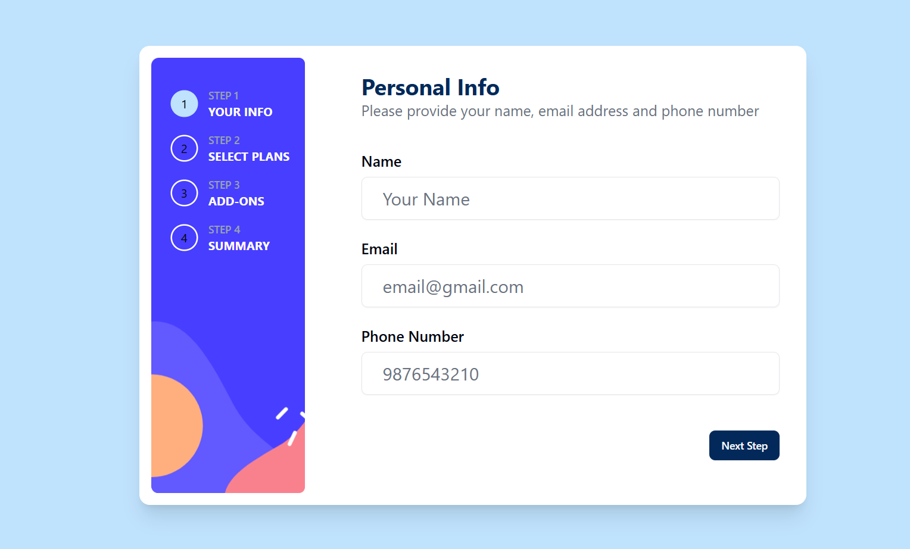

# Frontend Mentor - QR code component solution

This is a solution to the [Multi Step Form on Frontend Mentor](https://www.frontendmentor.io/challenges/multistep-form-YVAnSdqQBJ). 
Frontend Mentor have numerous challenges to help improve coding skills by building realistic projects. 

## Table of contents

- [Overview](#overview)
  - [Screenshot](#screenshot)
  - [Links](#links)
  - [Built with](#built-with)
- [Author](#author)
- [Acknowledgments](#acknowledgments)

## Overview
  ### It is Country Details App. Used to give details of all the countries.
### Screenshot

### Links

- GitHub URL: [Code](https://github.com/sridhar-geek/mult-step-form)
- Site URL: [Demo](https://mult-step-form-pied.vercel.app/)

### Built with

- Next.js
- TypeScript
- Tailwind CSS
-  Shadcn
- Context Api
- React-hook-form
- Zod

## Author

- Frontend Mentor - [@sridhar-geek](https://www.frontendmentor.io/profile/sridhar-geek)

## Acknowledgments

